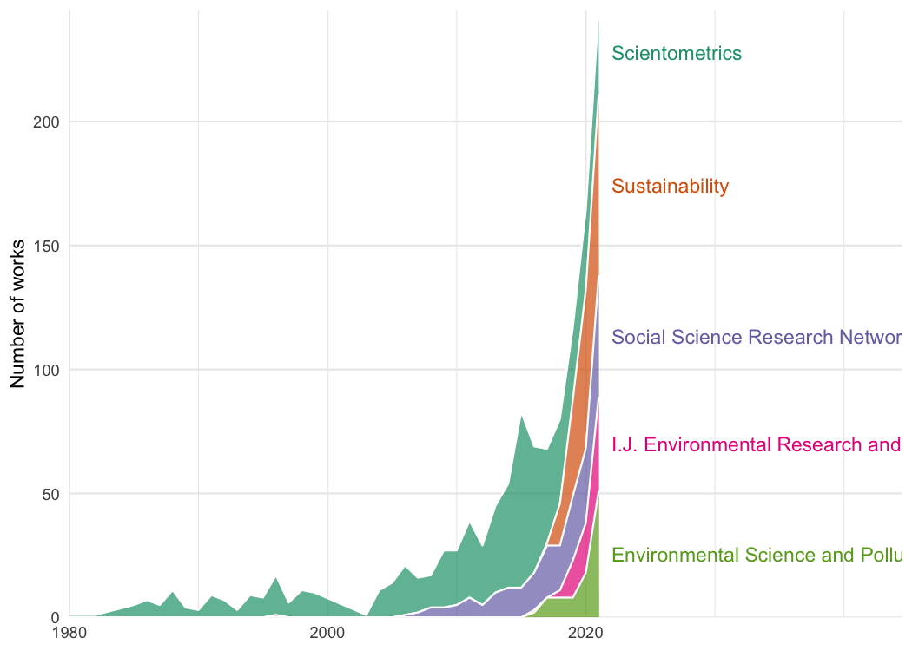
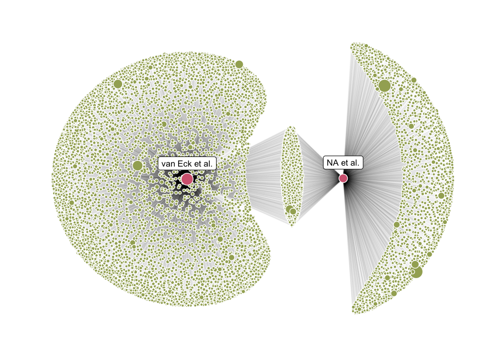

Examples shown in the R Journal manuscript
================
2022-11-10

``` r
library(openalexR)
library(tidyverse)
library(knitr)
library(gghighlight)
theme_set(
  theme_classic() +
    theme(
      plot.background = element_rect(fill = "transparent", colour = NA),
      panel.background = element_rect(fill = "transparent", colour = NA),
      strip.background = element_rect(fill = NA, color = "grey20")
    )
)
```

## Bibliometrics concept

``` r
concept <- oa_fetch(
  entity = "concepts",
  identifier = "C178315738", # openalex id
  count_only = FALSE,
  verbose = FALSE
)

concept$description
```

    ## [1] "statistical analysis of written publications, such as books or articles"

``` r
ancestors <- concept$ancestors[[1]] |>
  mutate(relation = "ancestor")

equal_level <- concept$related_concepts[[1]] |>
  filter(level == 2) |>
  mutate(relation = "equal level")

descendants <- concept$related_concepts[[1]] |>
  filter(level == 3) |>
  mutate(relation = "descendant")

bind_rows(ancestors, equal_level, descendants) |>
  relocate(relation) |>
  select(-wikidata)
```

    ##       relation                               id           display_name level
    ## 1     ancestor  https://openalex.org/C124101348            Data mining     1
    ## 2     ancestor  https://openalex.org/C161191863        Library science     1
    ## 3     ancestor  https://openalex.org/C136764020         World Wide Web     1
    ## 4     ancestor   https://openalex.org/C41008148       Computer science     0
    ## 5  equal level  https://openalex.org/C525823164         Scientometrics     2
    ## 6  equal level https://openalex.org/C2779455604          Impact factor     2
    ## 7  equal level https://openalex.org/C2778407487             Altmetrics     2
    ## 8  equal level  https://openalex.org/C521491914            Webometrics     2
    ## 9  equal level https://openalex.org/C2781083858  Scientific literature     2
    ## 10 equal level https://openalex.org/C2778805511               Citation     2
    ## 11 equal level   https://openalex.org/C95831776    Information science     2
    ## 12 equal level https://openalex.org/C2779172887               PageRank     2
    ## 13 equal level  https://openalex.org/C138368954            Peer review     2
    ## 14 equal level https://openalex.org/C2779810430 Knowledge organization     2
    ## 15 equal level https://openalex.org/C2780416505 Collection development     2
    ## 16  descendant  https://openalex.org/C105345328      Citation analysis     3
    ## 17  descendant https://openalex.org/C2778793908        Citation impact     3
    ## 18  descendant https://openalex.org/C2780378607           Informetrics     3
    ## 19  descendant https://openalex.org/C2778032371         Citation index     3
    ## 20  descendant   https://openalex.org/C83867959                 Scopus     3
    ## 21  descendant https://openalex.org/C2776822937 Bibliographic coupling     3
    ## 22  descendant https://openalex.org/C2779693592        Journal ranking     3
    ## 23  descendant   https://openalex.org/C45462083  Documentation science     3
    ## 24  descendant https://openalex.org/C2777765086            Co-citation     3
    ##        score
    ## 1         NA
    ## 2         NA
    ## 3         NA
    ## 4         NA
    ## 5  6.6193560
    ## 6  4.1035270
    ## 7  2.5396087
    ## 8  2.3026270
    ## 9  1.6163236
    ## 10 1.6110690
    ## 11 1.5750017
    ## 12 1.5363927
    ## 13 1.4112837
    ## 14 1.0037539
    ## 15 0.8137859
    ## 16 4.9036117
    ## 17 4.0405297
    ## 18 2.1396947
    ## 19 1.8888942
    ## 20 1.6536747
    ## 21 1.3375385
    ## 22 1.1321522
    ## 23 0.8473609
    ## 24 0.8002241

## Trends of biliometrics-related concepts

``` r
concept_df <- oa_fetch(
  entity = "concepts",
  identifier = c(concept$id, equal_level$id)
)

biblio_concepts <- concept_df |>
  select(display_name, counts_by_year) |>
  tidyr::unnest(counts_by_year) |>
  filter(year < 2022) |>
  mutate(year = as.Date(paste0("1jan", year), format = "%d%b%Y")) |>
  ggplot() +
  aes(x = year, y = works_count, color = display_name) +
  scale_color_viridis_d(option = "B", end = 0.8) +
  facet_wrap(~display_name) +
  geom_line(linewidth = 0.7) +
  labs(x = NULL, y = "Works count") +
  scale_y_log10() +
  scale_x_date(labels = scales::date_format("'%y")) +
  guides(color = "none") +
  gghighlight(use_direct_label = FALSE)
biblio_concepts
```


``` r
ggsave("images/biblio-concepts.png", biblio_concepts,
  dpi = 450, width = 7, height = 5
)
```

## Bibliometrics papers

``` r
biblio_works <- oa_fetch(
  entity = "works",
  concept.id = "C178315738",
  abstract = TRUE,
  count_only = FALSE
)
```

``` r
biblio_works |>
  count(so) |>
  drop_na(so) |>
  slice_max(n, n = 8) |>
  pull(so)
```

    ## [1] "Scientometrics"                                                   
    ## [2] "Journal of the Association for Information Science and Technology"
    ## [3] "Social Science Research Network"                                  
    ## [4] "Journal of Informetrics"                                          
    ## [5] "PLOS ONE"                                                         
    ## [6] "Sustainability"                                                   
    ## [7] "Sci-Tech Information Development & Economy"                       
    ## [8] "Library Philosophy and Practice"

``` r
biblio_journal <- biblio_works |>
  add_count(so, name = "n_so") |>
  count(so, publication_year, n_so, sort = TRUE) |>
  drop_na(so) |>
  mutate(so_rank = dense_rank(desc(n_so))) |>
  filter(so_rank < 9, publication_year < 2022) |>
  mutate(
    so = gsub("Journal of the|Journal of", "J.", so) |>
      as_factor() |>
      fct_reorder(so_rank)
  ) |>
  complete(so, publication_year, fill = list(n = 0)) |>
  mutate(
    label = if_else(publication_year == max(publication_year),
      as.character(so), NA_character_
    )
  ) |>
  ggplot(aes(x = publication_year, y = n, fill = so)) +
  geom_area(alpha = 0.7, color = "white") +
  geom_text(aes(label = label, color = so, x = publication_year + 1),
    position = position_stack(vjust = 0.5),
    hjust = 0, na.rm = TRUE
  ) +
  scale_y_continuous(expand = expansion(add = c(0, 0))) +
  scale_x_continuous(
    expand = expansion(add = c(0, 22.5)),
    breaks = c(1980, 2000, 2020)
  ) +
  scale_fill_brewer(palette = "Dark2") +
  scale_color_brewer(palette = "Dark2") +
  labs(y = "Number of works", x = NULL) +
  theme_minimal() +
  theme(panel.grid.minor.y = element_blank()) +
  guides(fill = "none", color = "none")

biblio_journal
```



``` r
ggsave("images/biblio-journals.png", biblio_journal,
  dpi = 450, height = 5, width = 10
)
```

## Two most cited articles and their citations and references

``` r
library(ggraph)
library(tidygraph)

seminal_works <- slice_max(biblio_works, cited_by_count, n = 8)
seminal_works$display_name
```

    ## [1] "Software survey: VOSviewer, a computer program for bibliometric mapping"                          
    ## [2] "Comparison of PubMed, Scopus, Web of Science, and Google Scholar: strengths and weaknesses"       
    ## [3] "Scope and Impact of Financial Conflicts of Interest in Biomedical Research"                       
    ## [4] "Empirical Studies Assessing the Quality of Health Information for Consumers on the World Wide Web"
    ## [5] "Bibliometric Methods in Management and Organization"                                              
    ## [6] "The journal coverage of Web of Science and Scopus: a comparative analysis"                        
    ## [7] "How popular is your paper? An empirical study of the citation distribution"                       
    ## [8] "Bibliometrics: The Leiden Manifesto for research metrics"

``` r
work_labels <- seminal_works[1:2, ] |>
  show_works() |>
  mutate(label = paste(word(first_author, 3, -1), "et al.")) |>
  select(id, label) |>
  deframe()

work_labels
```

    ##      W2150220236      W2120109270 
    ## "van Eck et al." "Falagas et al."

``` r
snowball_docs <- oa_snowball(
  identifier = seminal_works$id[1:2],
  verbose = TRUE
)
```

    ## Requesting url: https://api.openalex.org/works?filter=openalex_id%3Ahttps%3A%2F%2Fopenalex.org%2FW2150220236%7Chttps%3A%2F%2Fopenalex.org%2FW2120109270

    ## Getting 1 page of results with a total of 2 records...

    ## Collecting all documents citing the target papers...

    ## Requesting url: https://api.openalex.org/works?filter=cites%3AW2150220236%7CW2120109270

    ## Getting 34 pages of results with a total of 6779 records...

    ## Collecting all documents cited by the target papers...

    ## Requesting url: https://api.openalex.org/works?filter=cited_by%3AW2150220236%7CW2120109270

    ## Getting 1 page of results with a total of 40 records...

``` r
snow_graph <- as_tbl_graph(snowball_docs)

snowball_small <- snowball_docs |>
  as_tbl_graph() |>
  slice(1:500)

g_citation <- ggraph(graph = snow_graph, layout = "stress") +
  geom_edge_link(alpha = 0.02) +
  geom_node_point(
    data = ~ filter(.x, !oa_input),
    mapping = aes(size = cited_by_count),
    fill = "#a3ad62",
    shape = 21, color = "white"
  ) +
  geom_node_point(
    data = ~ filter(.x, oa_input),
    mapping = aes(size = cited_by_count),
    fill = "#d46780",
    shape = 21, color = "white"
  ) +
  theme_graph() +
  theme(legend.position = "bottom") +
  theme(
    plot.background = element_rect(fill = "transparent", colour = NA),
    panel.background = element_rect(fill = "transparent", colour = NA),
    strip.background = element_rect(fill = NA, color = "grey20")
  ) +
  guides(fill = "none", size = "none") +
  geom_node_label(aes(filter = oa_input, label = work_labels[id]), nudge_y = 0.2, size = 3)
g_citation
```



``` r
ggsave("images/citation-graph.png", g_citation,
  height = 5, width = 8
)
# save.image("data/oarj.rdata")
```

``` r
session_info()
```

    ## ─ Session info ───────────────────────────────────────────────────────────────
    ##  setting  value
    ##  version  R version 4.2.1 (2022-06-23)
    ##  os       macOS Big Sur ... 10.16
    ##  system   x86_64, darwin17.0
    ##  ui       X11
    ##  language (EN)
    ##  collate  en_US.UTF-8
    ##  ctype    en_US.UTF-8
    ##  tz       America/New_York
    ##  date     2022-11-10
    ##  pandoc   2.18 @ /Applications/RStudio.app/Contents/MacOS/quarto/bin/tools/ (via rmarkdown)
    ## 
    ## ─ Packages ───────────────────────────────────────────────────────────────────
    ##  package       * version    date (UTC) lib source
    ##  assertthat      0.2.1      2019-03-21 [1] CRAN (R 4.2.0)
    ##  backports       1.4.1      2021-12-13 [1] CRAN (R 4.2.0)
    ##  broom           1.0.1      2022-08-29 [1] CRAN (R 4.2.0)
    ##  cachem          1.0.6      2021-08-19 [1] CRAN (R 4.2.0)
    ##  callr           3.7.2      2022-08-22 [1] CRAN (R 4.2.0)
    ##  cellranger      1.1.0      2016-07-27 [1] CRAN (R 4.2.0)
    ##  cli             3.4.1      2022-09-23 [1] CRAN (R 4.2.0)
    ##  codetools       0.2-18     2020-11-04 [1] CRAN (R 4.2.1)
    ##  colorspace      2.0-3      2022-02-21 [1] CRAN (R 4.2.0)
    ##  crayon          1.5.1      2022-03-26 [1] CRAN (R 4.2.0)
    ##  DBI             1.1.3      2022-06-18 [1] CRAN (R 4.2.0)
    ##  dbplyr          2.2.1      2022-06-27 [1] CRAN (R 4.2.0)
    ##  devtools      * 2.4.4      2022-07-20 [1] CRAN (R 4.2.0)
    ##  digest          0.6.29     2021-12-01 [1] CRAN (R 4.2.0)
    ##  dplyr         * 1.0.10     2022-09-01 [1] CRAN (R 4.2.0)
    ##  ellipsis        0.3.2      2021-04-29 [1] CRAN (R 4.2.0)
    ##  evaluate        0.16       2022-08-09 [1] CRAN (R 4.2.0)
    ##  fansi           1.0.3      2022-03-24 [1] CRAN (R 4.2.0)
    ##  farver          2.1.1      2022-07-06 [1] CRAN (R 4.2.0)
    ##  fastmap         1.1.0      2021-01-25 [1] CRAN (R 4.2.0)
    ##  forcats       * 0.5.2      2022-08-19 [1] CRAN (R 4.2.0)
    ##  fs              1.5.2      2021-12-08 [1] CRAN (R 4.2.0)
    ##  gargle          1.2.0      2021-07-02 [1] CRAN (R 4.2.0)
    ##  generics        0.1.3      2022-07-05 [1] CRAN (R 4.2.0)
    ##  gghighlight   * 0.4.0      2022-10-16 [1] CRAN (R 4.2.0)
    ##  ggplot2       * 3.3.6.9000 2022-10-14 [1] Github (tidyverse/ggplot2@a58b48c)
    ##  glue            1.6.2      2022-02-24 [1] CRAN (R 4.2.0)
    ##  googledrive     2.0.0      2021-07-08 [1] CRAN (R 4.2.0)
    ##  googlesheets4   1.0.1      2022-08-13 [1] CRAN (R 4.2.0)
    ##  gtable          0.3.1      2022-09-01 [1] CRAN (R 4.2.0)
    ##  haven           2.5.1      2022-08-22 [1] CRAN (R 4.2.0)
    ##  highr           0.9        2021-04-16 [1] CRAN (R 4.2.0)
    ##  hms             1.1.2      2022-08-19 [1] CRAN (R 4.2.0)
    ##  htmltools       0.5.3      2022-07-18 [1] CRAN (R 4.2.0)
    ##  htmlwidgets     1.5.4      2021-09-08 [1] CRAN (R 4.2.0)
    ##  httpuv          1.6.6      2022-09-08 [1] CRAN (R 4.2.0)
    ##  httr            1.4.4      2022-08-17 [1] CRAN (R 4.2.0)
    ##  jsonlite        1.8.0      2022-02-22 [1] CRAN (R 4.2.0)
    ##  knitr         * 1.40       2022-08-24 [1] CRAN (R 4.2.0)
    ##  labeling        0.4.2      2020-10-20 [1] CRAN (R 4.2.0)
    ##  later           1.3.0      2021-08-18 [1] CRAN (R 4.2.0)
    ##  lifecycle       1.0.2      2022-09-09 [1] CRAN (R 4.2.0)
    ##  lubridate       1.8.0      2021-10-07 [1] CRAN (R 4.2.0)
    ##  magrittr        2.0.3      2022-03-30 [1] CRAN (R 4.2.0)
    ##  memoise         2.0.1      2021-11-26 [1] CRAN (R 4.2.0)
    ##  mime            0.12       2021-09-28 [1] CRAN (R 4.2.0)
    ##  miniUI          0.1.1.1    2018-05-18 [1] CRAN (R 4.2.0)
    ##  modelr          0.1.9      2022-08-19 [1] CRAN (R 4.2.0)
    ##  munsell         0.5.0      2018-06-12 [1] CRAN (R 4.2.0)
    ##  openalexR     * 1.0.2.9000 2022-11-09 [1] local
    ##  pillar          1.8.1      2022-08-19 [1] CRAN (R 4.2.0)
    ##  pkgbuild        1.3.1      2021-12-20 [1] CRAN (R 4.2.0)
    ##  pkgconfig       2.0.3      2019-09-22 [1] CRAN (R 4.2.0)
    ##  pkgload         1.3.0      2022-06-27 [1] CRAN (R 4.2.0)
    ##  prettyunits     1.1.1      2020-01-24 [1] CRAN (R 4.2.0)
    ##  processx        3.7.0      2022-07-07 [1] CRAN (R 4.2.0)
    ##  profvis         0.3.7      2020-11-02 [1] CRAN (R 4.2.0)
    ##  promises        1.2.0.1    2021-02-11 [1] CRAN (R 4.2.0)
    ##  ps              1.7.1      2022-06-18 [1] CRAN (R 4.2.0)
    ##  purrr         * 0.3.4      2020-04-17 [1] CRAN (R 4.2.0)
    ##  R6              2.5.1      2021-08-19 [1] CRAN (R 4.2.0)
    ##  RColorBrewer    1.1-3      2022-04-03 [1] CRAN (R 4.2.0)
    ##  Rcpp            1.0.9      2022-07-08 [1] CRAN (R 4.2.0)
    ##  readr         * 2.1.2      2022-01-30 [1] CRAN (R 4.2.0)
    ##  readxl          1.4.1      2022-08-17 [1] CRAN (R 4.2.0)
    ##  remotes         2.4.2      2021-11-30 [1] CRAN (R 4.2.0)
    ##  reprex          2.0.2      2022-08-17 [1] CRAN (R 4.2.0)
    ##  rlang           1.0.6      2022-09-24 [1] CRAN (R 4.2.0)
    ##  rmarkdown       2.16       2022-08-24 [1] CRAN (R 4.2.0)
    ##  rstudioapi      0.14       2022-08-22 [1] CRAN (R 4.2.0)
    ##  rvest           1.0.3      2022-08-19 [1] CRAN (R 4.2.0)
    ##  scales          1.2.1      2022-08-20 [1] CRAN (R 4.2.0)
    ##  sessioninfo     1.2.2      2021-12-06 [1] CRAN (R 4.2.0)
    ##  shiny           1.7.2      2022-07-19 [1] CRAN (R 4.2.0)
    ##  stringi         1.7.8      2022-07-11 [1] CRAN (R 4.2.0)
    ##  stringr       * 1.4.1      2022-08-20 [1] CRAN (R 4.2.0)
    ##  tibble        * 3.1.8      2022-07-22 [1] CRAN (R 4.2.0)
    ##  tidyr         * 1.2.1      2022-09-08 [1] CRAN (R 4.2.0)
    ##  tidyselect      1.1.2      2022-02-21 [1] CRAN (R 4.2.0)
    ##  tidyverse     * 1.3.2      2022-07-18 [1] CRAN (R 4.2.0)
    ##  tzdb            0.3.0      2022-03-28 [1] CRAN (R 4.2.0)
    ##  urlchecker      1.0.1      2021-11-30 [1] CRAN (R 4.2.0)
    ##  usethis       * 2.1.6      2022-05-25 [1] CRAN (R 4.2.0)
    ##  utf8            1.2.2      2021-07-24 [1] CRAN (R 4.2.0)
    ##  vctrs           0.4.2      2022-09-29 [1] CRAN (R 4.2.0)
    ##  withr           2.5.0      2022-03-03 [1] CRAN (R 4.2.0)
    ##  xfun            0.33       2022-09-12 [1] CRAN (R 4.2.0)
    ##  xml2            1.3.3      2021-11-30 [1] CRAN (R 4.2.0)
    ##  xtable          1.8-4      2019-04-21 [1] CRAN (R 4.2.0)
    ##  yaml            2.3.5      2022-02-21 [1] CRAN (R 4.2.0)
    ## 
    ##  [1] /Library/Frameworks/R.framework/Versions/4.2/Resources/library
    ## 
    ## ──────────────────────────────────────────────────────────────────────────────
