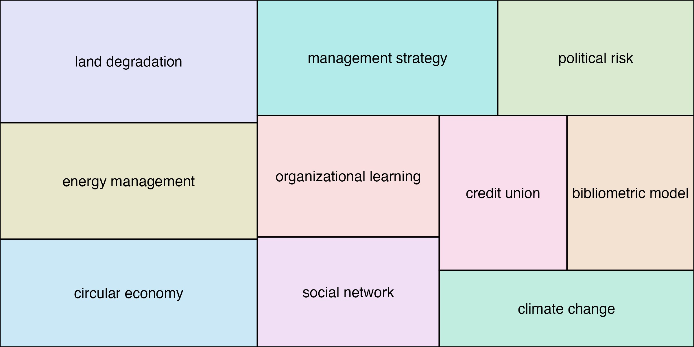

Examples shown in the R Journal manuscript
================
2022-11-10

**NOTE**: To replicate the analyses proposed in the manuscript, please
use the downloaded data at `data/oarj.rdata`. Because bibliographic
metadata change at high frequency, downloads made on different days
could provide slightly different results (*e.g.*, number of citations,
number of published articles, *etc.*). The `oarj.rdata` file contains
all the objects we needed for this analysis.

``` r
set.seed(1234)
library(openalexR)
library(tidyverse)
```

    ## ── Attaching packages ─────────────────────────────────────── tidyverse 1.3.2 ──
    ## ✔ ggplot2 3.3.6.9000     ✔ purrr   0.3.4     
    ## ✔ tibble  3.1.8          ✔ dplyr   1.0.10    
    ## ✔ tidyr   1.2.1          ✔ stringr 1.4.1     
    ## ✔ readr   2.1.2          ✔ forcats 0.5.2     
    ## ── Conflicts ────────────────────────────────────────── tidyverse_conflicts() ──
    ## ✖ dplyr::filter() masks stats::filter()
    ## ✖ dplyr::lag()    masks stats::lag()

``` r
library(gghighlight)
library(ggraph)
library(tidygraph)
```

    ## 
    ## Attaching package: 'tidygraph'
    ## 
    ## The following object is masked from 'package:stats':
    ## 
    ##     filter

``` r
library(treemap)
theme_set(
  theme_classic() +
    theme(
      plot.background = element_rect(fill = "transparent", colour = NA),
      panel.background = element_rect(fill = "transparent", colour = NA),
      strip.background = element_rect(fill = NA, color = "grey20")
    )
)
```

## Bibliometrics concept

``` r
concept <- oa_fetch(
  entity = "concepts",
  identifier = "C178315738" # OAID for "bibliometrics"
)

cat(concept$description, "is a level", concept$level, "concept")
```

    ## statistical analysis of written publications, such as books or articles is a level 2 concept

``` r
related_concepts <- concept$related_concepts[[1]] |>
  mutate(relation = case_when(
    level < 2 ~ "ancestor",
    level == 2 ~ "equal level",
    TRUE ~ "descendant"
  )) |>
  arrange(level) |>
  relocate(relation) |>
  select(-wikidata)

related_concepts
```

    ##       relation                               id           display_name level
    ## 1     ancestor   https://openalex.org/C41008148       Computer science     0
    ## 2     ancestor   https://openalex.org/C36289849         Social science     1
    ## 3     ancestor  https://openalex.org/C124101348            Data mining     1
    ## 4  equal level  https://openalex.org/C525823164         Scientometrics     2
    ## 5  equal level https://openalex.org/C2779455604          Impact factor     2
    ## 6  equal level https://openalex.org/C2778407487             Altmetrics     2
    ## 7  equal level  https://openalex.org/C521491914            Webometrics     2
    ## 8  equal level https://openalex.org/C2781083858  Scientific literature     2
    ## 9  equal level https://openalex.org/C2778805511               Citation     2
    ## 10 equal level   https://openalex.org/C95831776    Information science     2
    ## 11 equal level https://openalex.org/C2779172887               PageRank     2
    ## 12 equal level  https://openalex.org/C138368954            Peer review     2
    ## 13 equal level https://openalex.org/C2779810430 Knowledge organization     2
    ## 14 equal level https://openalex.org/C2780416505 Collection development     2
    ## 15  descendant  https://openalex.org/C105345328      Citation analysis     3
    ## 16  descendant https://openalex.org/C2778793908        Citation impact     3
    ## 17  descendant https://openalex.org/C2780378607           Informetrics     3
    ## 18  descendant https://openalex.org/C2778032371         Citation index     3
    ## 19  descendant   https://openalex.org/C83867959                 Scopus     3
    ## 20  descendant https://openalex.org/C2776822937 Bibliographic coupling     3
    ## 21  descendant https://openalex.org/C2779693592        Journal ranking     3
    ## 22  descendant   https://openalex.org/C45462083  Documentation science     3
    ## 23  descendant https://openalex.org/C2777765086            Co-citation     3
    ##        score
    ## 1  1.3350035
    ## 2  1.6031636
    ## 3  1.5347114
    ## 4  6.6193560
    ## 5  4.1035270
    ## 6  2.5396087
    ## 7  2.3026270
    ## 8  1.6163236
    ## 9  1.6110690
    ## 10 1.5750017
    ## 11 1.5363927
    ## 12 1.4112837
    ## 13 1.0037539
    ## 14 0.8137859
    ## 15 4.9036117
    ## 16 4.0405297
    ## 17 2.1396947
    ## 18 1.8888942
    ## 19 1.6536747
    ## 20 1.3375385
    ## 21 1.1321522
    ## 22 0.8473609
    ## 23 0.8002241

``` r
equal_ids <- related_concepts |>
  filter(relation == "equal level") |>
  pull(id)
```

## Trends of biliometrics-related concepts

``` r
concept_df <- oa_fetch(
  entity = "concepts",
  identifier = c(concept$id, equal_ids)
)

biblio_concepts <- concept_df |>
  select(display_name, counts_by_year) |>
  tidyr::unnest(counts_by_year) |>
  filter(year < 2022) |>
  mutate(year = as.Date(paste0("1jan", year), format = "%d%b%Y")) |>
  ggplot() +
  aes(x = year, y = works_count, color = display_name) +
  scale_color_viridis_d(option = "B", end = 0.8) +
  facet_wrap(~display_name) +
  geom_line(linewidth = 0.7) +
  labs(x = NULL, y = "Works count") +
  scale_y_log10() +
  scale_x_date(labels = scales::date_format("'%y")) +
  guides(color = "none") +
  gghighlight(use_direct_label = FALSE)

biblio_concepts
```


``` r
ggsave("images/biblio-concepts.png", biblio_concepts,
  dpi = 450, width = 7, height = 5
)
```

## Bibliometrics papers

``` r
oa_fetch(
  entity = "works",
  title.search = "bibliometrics|science mapping",
  count_only = TRUE,
  verbose = TRUE
)

biblio_works <- oa_fetch(
  entity = "works",
  title.search = "bibliometrics|science mapping",
  count_only = FALSE,
  verbose = TRUE
)
```

``` r
biblio_works |>
  count(so) |>
  drop_na(so) |>
  slice_max(n, n = 5) |>
  pull(so)
```

    ## [1] "Scientometrics"                                                   
    ## [2] "Sustainability"                                                   
    ## [3] "Social Science Research Network"                                  
    ## [4] "International Journal of Environmental Research and Public Health"
    ## [5] "Environmental Science and Pollution Research"

``` r
biblio_journal <- biblio_works |>
  add_count(so, name = "n_so") |>
  count(so, publication_year, n_so, sort = TRUE) |>
  drop_na(so) |>
  mutate(so_rank = dense_rank(desc(n_so))) |>
  filter(so_rank < 6, publication_year < 2022) |>
  mutate(
    so = gsub("International Journal of|Journal of the|Journal of", "I.J.", so) |>
      as_factor() |>
      fct_reorder(so_rank)
  ) |>
  complete(so, publication_year, fill = list(n = 0)) |>
  mutate(
    label = if_else(publication_year == max(publication_year),
      as.character(so), NA_character_
    )
  ) |>
  ggplot(aes(x = publication_year, y = n, fill = so)) +
  geom_area(alpha = 0.7, color = "white") +
  geom_text(aes(label = label, color = so, x = publication_year + 1),
    position = position_stack(vjust = 0.5),
    hjust = 0, na.rm = TRUE
  ) +
  scale_y_continuous(expand = expansion(add = c(0, 0))) +
  scale_x_continuous(
    expand = expansion(add = c(0, 22.5)),
    breaks = c(1980, 2000, 2020)
  ) +
  scale_fill_brewer(palette = "Dark2") +
  scale_color_brewer(palette = "Dark2") +
  labs(y = "Number of works", x = NULL) +
  theme_minimal() +
  theme(panel.grid.minor.y = element_blank()) +
  guides(fill = "none", color = "none")

biblio_journal
```


``` r
ggsave("images/biblio-journals.png", biblio_journal,
  dpi = 450, height = 5, width = 10
)
```

``` r
biblio_authors_raw <- do.call(rbind.data.frame, biblio_works$author)
biblio_insts <- biblio_authors_raw |>
  count(institution_display_name) |>
  rename("name" = institution_display_name) |>
  drop_na(name) |>
  slice_max(n, n = 10) |>
  mutate(type = "Institution")

biblio_authors <- biblio_authors_raw |>
  count(au_display_name) |>
  rename("name" = au_display_name) |>
  drop_na(name) |>
  slice_max(n, n = 10) |>
  mutate(type = "Author")

biblio_aut_insts <- biblio_authors |>
  bind_rows(biblio_insts) |>
  group_by(type) |>
  mutate(name = forcats::fct_reorder(name, n)) |>
  ggplot() +
  aes(x = n, y = name) +
  geom_segment(aes(yend = name, x = 0, xend = n)) +
  geom_point(aes(color = type), size = 3) +
  facet_wrap(~type, scales = "free") +
  scale_color_manual(values = c("#d46780", "#a3ad62"), guide = "none") +
  labs(x = "Number of articles", y = NULL) +
  theme(panel.spacing = unit(3, "lines"))

biblio_aut_insts
```


``` r
ggsave("images/biblio-authors-institutions.png", biblio_aut_insts,
  dpi = 450, height = 3.5, width = 8
)
```

## Two most cited articles and their citations and references

``` r
seminal_works <- slice_max(biblio_works, cited_by_count, n = 10)
seminal_works |>
  select(publication_year, display_name, so, cited_by_count)
```

    ## # A tibble: 10 × 4
    ##    publication_year display_name                                   so    cited…¹
    ##               <int> <chr>                                          <chr>   <int>
    ##  1             2010 Software survey: VOSviewer, a computer progra… Scie…    5557
    ##  2             2017 bibliometrix : An R-tool for comprehensive sc… Jour…    2244
    ##  3             2015 Bibliometric Methods in Management and Organi… Orga…    1586
    ##  4             1976 A general theory of bibliometric and other cu… Jour…    1508
    ##  5             2015 Bibliometrics: The Leiden Manifesto for resea… Natu…    1181
    ##  6             2011 Science mapping software tools: Review, analy… Jour…    1131
    ##  7             2004 Changes in the intellectual structure of stra… Stra…    1044
    ##  8             2010 A unified approach to mapping and clustering … Jour…     948
    ##  9             2015 Green supply chain management: A review and b… Inte…     934
    ## 10             2021 How to conduct a bibliometric analysis: An ov… Jour…     837
    ## # … with abbreviated variable name ¹​cited_by_count

``` r
sb_docs <- oa_snowball(
  identifier = seminal_works$id[1:2],
  citing_filter = list(from_publication_date = "2022-01-01"),
  verbose = TRUE
)
```

    ## Requesting url: https://api.openalex.org/works?filter=openalex_id%3Ahttps%3A%2F%2Fopenalex.org%2FW2150220236%7Chttps%3A%2F%2Fopenalex.org%2FW2755950973

    ## Getting 1 page of results with a total of 2 records...

    ## Collecting all documents citing the target papers...

    ## Requesting url: https://api.openalex.org/works?filter=cites%3AW2150220236%7CW2755950973%2Cfrom_publication_date%3A2022-01-01

    ## Getting 16 pages of results with a total of 3037 records...

    ## Collecting all documents cited by the target papers...

    ## Requesting url: https://api.openalex.org/works?filter=cited_by%3AW2150220236%7CW2755950973

    ## Getting 1 page of results with a total of 72 records...

``` r
sg_1 <- tidygraph::as_tbl_graph(sb_docs)

AU <- sb_docs$nodes |>
  select(author) |>
  unlist(recursive = FALSE) |>
  lapply(function(l) {
    paste(l$au_display_name, collapse = "; ")
  }) |>
  unlist()

g_citation <- ggraph(graph = sg_1, layout = "stress") +
  aes(size = cited_by_count) +
  geom_edge_link(color = "grey60", alpha = 0.30, show.legend = FALSE) +
  scale_edge_width(range = c(0.1, 1.5), guide = "none") +
  scale_size(range = c(1, 3), guide = "none") +
  geom_node_point(aes(filter = !oa_input), fill = "#a3ad62", shape = 21, color = "white") +
  geom_node_point(aes(filter = oa_input), fill = "#d46780", shape = 21, color = "white") +
  theme_graph() +
  guides(fill = "none", size = "none") +
  geom_node_label(aes(filter = oa_input, label = AU), nudge_y = 0.2, size = 3)
g_citation
```


N-grams

``` r
# options("oa_ngrams.message.curlv5" = TRUE)
ngrams_data <- oa_ngrams(sample(biblio_works$id, 1000), verbose = TRUE)
top_10 <- do.call(rbind.data.frame, ngrams_data$ngrams) |>
  filter(ngram_tokens == 2, nchar(ngram) > 10) |>
  arrange(desc(ngram_count)) |>
  slice_max(ngram_count, n = 10, with_ties = FALSE)

top_10
```

    ##                          ngram ngram_tokens ngram_count term_frequency
    ## 1             circular economy            2         240    0.022249003
    ## 2              natural capital            2         134    0.021742658
    ## 3               internal audit            2         102    0.006665795
    ## 4            ecosystem service            2          97    0.014806900
    ## 5  interorganizational network            2          96    0.009058313
    ## 6          fractional counting            2          92    0.008700586
    ## 7       rural entrepreneurship            2          91    0.009667481
    ## 8           relate publication            2          90    0.007140024
    ## 9                  highly cite            2          72    0.010990688
    ## 10           internal auditing            2          71    0.004639916

``` r
tm <- treemap(
  dtf = top_10,
  index = c("ngram"),
  vSize = "ngram_count",
  vColor = "ngram"
) |> 
  invisible()
```

``` r
head(tm$tm)
```

    ##                 ngram vSize vColor stdErr vColorValue level        x0        y0
    ## 1    circular economy   240      1    240          NA     1 0.0000000 0.3582888
    ## 2   ecosystem service    97      1     97          NA     1 0.5712786 0.5850914
    ## 3 fractional counting    92      1     92          NA     1 0.3447005 0.2909471
    ## 4         highly cite    72      1     72          NA     1 0.8368752 0.1782897
    ## 5      internal audit   102      1    102          NA     1 0.3447005 0.5850914
    ## 6   internal auditing    71      1     71          NA     1 0.6329692 0.0000000
    ##           w         h   color
    ## 1 0.3447005 0.6417112 #D6A166
    ## 2 0.2154714 0.4149086 #50B6E0
    ## 3 0.2882688 0.2941443 #2DC194
    ## 4 0.1631248 0.4068018 #EB8DC1
    ## 5 0.2265781 0.4149086 #B2AF4F
    ## 6 0.3670308 0.1782897 #A1A5EC

``` r
tm_plot_data <- tm$tm |>
  mutate(
    # calculate end coordinates with height and width
    x1 = x0 + w,
    y1 = y0 + h,
    # get center coordinates for labels
    x = (x0 + x1) / 2,
    y = (y0 + y1) / 2
  )

ngram_plot <- ggplot(tm_plot_data, aes(xmin = x0, ymin = y0, xmax = x1, ymax = y1)) +
  geom_rect(aes(fill = color), show.legend = FALSE, color = "black", alpha = .3) +
  scale_fill_identity() +
  ggfittext::geom_fit_text(aes(label = ngram), min.size = 1) +
  scale_x_continuous(expand = c(0, 0)) +
  scale_y_continuous(expand = c(0, 0)) +
  theme_void()

ngram_plot
```



``` r
ggsave("images/citation-graph.png", g_citation,
  height = 5, width = 8
)
ggsave("images/ngram-treemap.png", ngram_plot,
  height = 4, width = 8
)

save.image("data/oarj.rdata")
```

``` r
session_info()
```

    ## ─ Session info ───────────────────────────────────────────────────────────────
    ##  setting  value
    ##  version  R version 4.2.1 (2022-06-23)
    ##  os       macOS Big Sur ... 10.16
    ##  system   x86_64, darwin17.0
    ##  ui       X11
    ##  language (EN)
    ##  collate  en_US.UTF-8
    ##  ctype    en_US.UTF-8
    ##  tz       America/New_York
    ##  date     2023-02-07
    ##  pandoc   2.18 @ /Applications/RStudio.app/Contents/MacOS/quarto/bin/tools/ (via rmarkdown)
    ## 
    ## ─ Packages ───────────────────────────────────────────────────────────────────
    ##  package       * version    date (UTC) lib source
    ##  assertthat      0.2.1      2019-03-21 [1] CRAN (R 4.2.0)
    ##  backports       1.4.1      2021-12-13 [1] CRAN (R 4.2.0)
    ##  broom           1.0.1      2022-08-29 [1] CRAN (R 4.2.0)
    ##  cachem          1.0.6      2021-08-19 [1] CRAN (R 4.2.0)
    ##  callr           3.7.2      2022-08-22 [1] CRAN (R 4.2.0)
    ##  cellranger      1.1.0      2016-07-27 [1] CRAN (R 4.2.0)
    ##  cli             3.4.1      2022-09-23 [1] CRAN (R 4.2.0)
    ##  colorspace      2.0-3      2022-02-21 [1] CRAN (R 4.2.0)
    ##  crayon          1.5.1      2022-03-26 [1] CRAN (R 4.2.0)
    ##  curl            5.0.0      2023-01-12 [1] CRAN (R 4.2.0)
    ##  data.table      1.14.2     2021-09-27 [1] CRAN (R 4.2.0)
    ##  DBI             1.1.3      2022-06-18 [1] CRAN (R 4.2.0)
    ##  dbplyr          2.2.1      2022-06-27 [1] CRAN (R 4.2.0)
    ##  devtools      * 2.4.4      2022-07-20 [1] CRAN (R 4.2.0)
    ##  digest          0.6.29     2021-12-01 [1] CRAN (R 4.2.0)
    ##  dplyr         * 1.0.10     2022-09-01 [1] CRAN (R 4.2.0)
    ##  ellipsis        0.3.2      2021-04-29 [1] CRAN (R 4.2.0)
    ##  evaluate        0.16       2022-08-09 [1] CRAN (R 4.2.0)
    ##  fansi           1.0.3      2022-03-24 [1] CRAN (R 4.2.0)
    ##  farver          2.1.1      2022-07-06 [1] CRAN (R 4.2.0)
    ##  fastmap         1.1.0      2021-01-25 [1] CRAN (R 4.2.0)
    ##  forcats       * 0.5.2      2022-08-19 [1] CRAN (R 4.2.0)
    ##  fs              1.5.2      2021-12-08 [1] CRAN (R 4.2.0)
    ##  gargle          1.2.0      2021-07-02 [1] CRAN (R 4.2.0)
    ##  generics        0.1.3      2022-07-05 [1] CRAN (R 4.2.0)
    ##  ggfittext       0.9.1      2021-01-30 [1] CRAN (R 4.2.0)
    ##  ggforce         0.4.1      2022-10-04 [1] CRAN (R 4.2.0)
    ##  gghighlight   * 0.4.0      2022-10-16 [1] CRAN (R 4.2.0)
    ##  ggplot2       * 3.3.6.9000 2022-10-14 [1] Github (tidyverse/ggplot2@a58b48c)
    ##  ggraph        * 2.1.0      2022-10-09 [1] CRAN (R 4.2.0)
    ##  ggrepel         0.9.1      2021-01-15 [1] CRAN (R 4.2.0)
    ##  glue            1.6.2      2022-02-24 [1] CRAN (R 4.2.0)
    ##  googledrive     2.0.0      2021-07-08 [1] CRAN (R 4.2.0)
    ##  googlesheets4   1.0.1      2022-08-13 [1] CRAN (R 4.2.0)
    ##  graphlayouts    0.8.2      2022-09-29 [1] CRAN (R 4.2.0)
    ##  gridBase        0.4-7      2014-02-24 [1] CRAN (R 4.2.0)
    ##  gridExtra       2.3        2017-09-09 [1] CRAN (R 4.2.0)
    ##  gtable          0.3.1      2022-09-01 [1] CRAN (R 4.2.0)
    ##  haven           2.5.1      2022-08-22 [1] CRAN (R 4.2.0)
    ##  highr           0.9        2021-04-16 [1] CRAN (R 4.2.0)
    ##  hms             1.1.2      2022-08-19 [1] CRAN (R 4.2.0)
    ##  htmltools       0.5.3      2022-07-18 [1] CRAN (R 4.2.0)
    ##  htmlwidgets     1.5.4      2021-09-08 [1] CRAN (R 4.2.0)
    ##  httpuv          1.6.6      2022-09-08 [1] CRAN (R 4.2.0)
    ##  httr            1.4.4      2022-08-17 [1] CRAN (R 4.2.0)
    ##  igraph          1.3.4      2022-07-19 [1] CRAN (R 4.2.0)
    ##  jsonlite        1.8.0      2022-02-22 [1] CRAN (R 4.2.0)
    ##  knitr           1.40       2022-08-24 [1] CRAN (R 4.2.0)
    ##  labeling        0.4.2      2020-10-20 [1] CRAN (R 4.2.0)
    ##  later           1.3.0      2021-08-18 [1] CRAN (R 4.2.0)
    ##  lifecycle       1.0.2      2022-09-09 [1] CRAN (R 4.2.0)
    ##  lubridate       1.8.0      2021-10-07 [1] CRAN (R 4.2.0)
    ##  magrittr        2.0.3      2022-03-30 [1] CRAN (R 4.2.0)
    ##  MASS            7.3-57     2022-04-22 [1] CRAN (R 4.2.1)
    ##  memoise         2.0.1      2021-11-26 [1] CRAN (R 4.2.0)
    ##  mime            0.12       2021-09-28 [1] CRAN (R 4.2.0)
    ##  miniUI          0.1.1.1    2018-05-18 [1] CRAN (R 4.2.0)
    ##  modelr          0.1.9      2022-08-19 [1] CRAN (R 4.2.0)
    ##  munsell         0.5.0      2018-06-12 [1] CRAN (R 4.2.0)
    ##  openalexR     * 1.0.2.9000 2023-01-31 [1] local
    ##  pillar          1.8.1      2022-08-19 [1] CRAN (R 4.2.0)
    ##  pkgbuild        1.3.1      2021-12-20 [1] CRAN (R 4.2.0)
    ##  pkgconfig       2.0.3      2019-09-22 [1] CRAN (R 4.2.0)
    ##  pkgload         1.3.0      2022-06-27 [1] CRAN (R 4.2.0)
    ##  polyclip        1.10-0     2019-03-14 [1] CRAN (R 4.2.0)
    ##  prettyunits     1.1.1      2020-01-24 [1] CRAN (R 4.2.0)
    ##  processx        3.7.0      2022-07-07 [1] CRAN (R 4.2.0)
    ##  profvis         0.3.7      2020-11-02 [1] CRAN (R 4.2.0)
    ##  progress        1.2.2      2019-05-16 [1] CRAN (R 4.2.0)
    ##  promises        1.2.0.1    2021-02-11 [1] CRAN (R 4.2.0)
    ##  ps              1.7.1      2022-06-18 [1] CRAN (R 4.2.0)
    ##  purrr         * 0.3.4      2020-04-17 [1] CRAN (R 4.2.0)
    ##  R6              2.5.1      2021-08-19 [1] CRAN (R 4.2.0)
    ##  ragg            1.2.2      2022-02-21 [1] CRAN (R 4.2.0)
    ##  RColorBrewer    1.1-3      2022-04-03 [1] CRAN (R 4.2.0)
    ##  Rcpp            1.0.9      2022-07-08 [1] CRAN (R 4.2.0)
    ##  readr         * 2.1.2      2022-01-30 [1] CRAN (R 4.2.0)
    ##  readxl          1.4.1      2022-08-17 [1] CRAN (R 4.2.0)
    ##  remotes         2.4.2      2021-11-30 [1] CRAN (R 4.2.0)
    ##  reprex          2.0.2      2022-08-17 [1] CRAN (R 4.2.0)
    ##  rlang           1.0.6      2022-09-24 [1] CRAN (R 4.2.0)
    ##  rmarkdown       2.16       2022-08-24 [1] CRAN (R 4.2.0)
    ##  rstudioapi      0.14       2022-08-22 [1] CRAN (R 4.2.0)
    ##  rvest           1.0.3      2022-08-19 [1] CRAN (R 4.2.0)
    ##  scales          1.2.1      2022-08-20 [1] CRAN (R 4.2.0)
    ##  sessioninfo     1.2.2      2021-12-06 [1] CRAN (R 4.2.0)
    ##  shiny           1.7.2      2022-07-19 [1] CRAN (R 4.2.0)
    ##  stringi         1.7.8      2022-07-11 [1] CRAN (R 4.2.0)
    ##  stringr       * 1.4.1      2022-08-20 [1] CRAN (R 4.2.0)
    ##  systemfonts     1.0.4      2022-02-11 [1] CRAN (R 4.2.0)
    ##  textshaping     0.3.6      2021-10-13 [1] CRAN (R 4.2.0)
    ##  tibble        * 3.1.8      2022-07-22 [1] CRAN (R 4.2.0)
    ##  tidygraph     * 1.2.2      2022-08-22 [1] CRAN (R 4.2.0)
    ##  tidyr         * 1.2.1      2022-09-08 [1] CRAN (R 4.2.0)
    ##  tidyselect      1.1.2      2022-02-21 [1] CRAN (R 4.2.0)
    ##  tidyverse     * 1.3.2      2022-07-18 [1] CRAN (R 4.2.0)
    ##  treemap       * 2.4-3      2021-08-22 [1] CRAN (R 4.2.0)
    ##  tweenr          2.0.2      2022-09-06 [1] CRAN (R 4.2.0)
    ##  tzdb            0.3.0      2022-03-28 [1] CRAN (R 4.2.0)
    ##  urlchecker      1.0.1      2021-11-30 [1] CRAN (R 4.2.0)
    ##  usethis       * 2.1.6      2022-05-25 [1] CRAN (R 4.2.0)
    ##  utf8            1.2.2      2021-07-24 [1] CRAN (R 4.2.0)
    ##  vctrs           0.4.2      2022-09-29 [1] CRAN (R 4.2.0)
    ##  viridis         0.6.2      2021-10-13 [1] CRAN (R 4.2.0)
    ##  viridisLite     0.4.1      2022-08-22 [1] CRAN (R 4.2.0)
    ##  withr           2.5.0      2022-03-03 [1] CRAN (R 4.2.0)
    ##  xfun            0.33       2022-09-12 [1] CRAN (R 4.2.0)
    ##  xml2            1.3.3      2021-11-30 [1] CRAN (R 4.2.0)
    ##  xtable          1.8-4      2019-04-21 [1] CRAN (R 4.2.0)
    ##  yaml            2.3.5      2022-02-21 [1] CRAN (R 4.2.0)
    ## 
    ##  [1] /Library/Frameworks/R.framework/Versions/4.2/Resources/library
    ## 
    ## ──────────────────────────────────────────────────────────────────────────────
